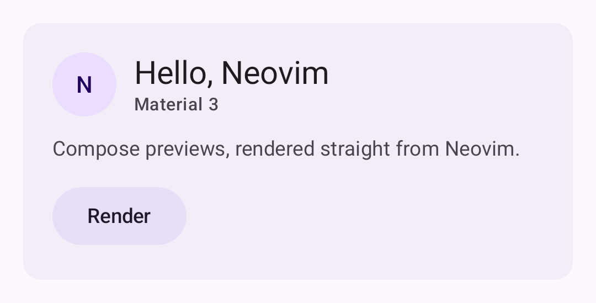
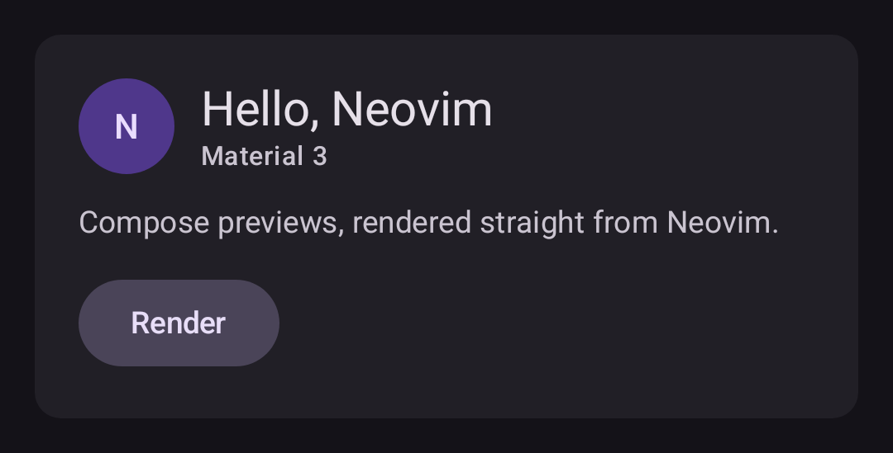

# compose-preview.nvim

[](https://github.com/ntsk/compose-preview.nvim/actions/workflows/ci.yml)
[](LICENSE)

Render Jetpack Compose `@Preview` from Neovim.

It renders with layoutlib through Google's standalone Compose preview renderer,
built from the code Android Studio renders previews with but packaged to run
headlessly, and shows the resulting PNGs in your browser. No emulator, no device,
no Android Studio.

Output is close to what Android Studio shows, but this is not Android Studio's
preview and the two are not guaranteed to agree.

<table>
  <tr>
    <td width="50%"></td>
    <td width="50%"></td>
  </tr>
  <tr>
    <td align="center"><code>@PreviewLightDark</code> — light</td>
    <td align="center"><code>@PreviewLightDark</code> — dark</td>
  </tr>
</table>

Real output from [`sample/`](sample/app/src/main/java/com/example/sample/Greeting.kt),
rendered by the plugin.

## How it works

```
find @Preview in the .kt buffer with treesitter
  -> resolve classpath and resource APK through Gradle
  -> run compose-preview-renderer (layoutlib)
  -> PNG + results.json
  -> generate HTML and open it in a browser
```

Rendering uses the artifacts Google publishes below. All of them come from Google
Maven, so an Android Studio installation is not needed. They are downloaded into
`~/.cache/nvim/compose-preview` on first use (about 300 MB).

| artifact | purpose |
|---|---|
| `com.android.tools.compose:compose-preview-renderer` | the renderer itself |
| `com.android.tools.layoutlib:layoutlib` | Android framework classes |
| `com.android.tools.layoutlib:layoutlib-runtime` | native libraries and fonts |
| `com.android.tools.layoutlib:layoutlib-resources` | framework resources |

The versions are pinned in [`lua/compose-preview/toolchain.lua`](lua/compose-preview/toolchain.lua).
They are not independent — the renderer only works with the layoutlib it was
built against — so they are updated together and every change is checked by
rendering `sample/` in CI.

Google publishes the renderer as an alpha and does change its internals between
releases; layoutlib is the mature part, and ships with every Android Studio
release under its own versioning.

## Requirements

- Neovim 0.11 or newer
- The `kotlin` treesitter parser
- **Java 21 or newer** (layoutlib is built as class file 65.0)
- A Compose project with the Android SDK and a Gradle wrapper

## Installation

With [lazy.nvim](https://github.com/folke/lazy.nvim):

```lua
{
  'ntsk/compose-preview.nvim',
  ft = 'kotlin',
  cmd = 'ComposePreview',
  opts = {},
}
```

With [packer.nvim](https://github.com/wbthomason/packer.nvim):

```lua
use({
  'ntsk/compose-preview.nvim',
  config = function()
    require('compose-preview').setup({})
  end,
})
```

Calling `setup()` is optional; the defaults work without it.

Then run `:checkhealth compose-preview` to confirm Java, the Kotlin treesitter
parser, and the external tools are in place.

## Usage

Open a `.kt` file containing `@Preview` and run `:ComposePreview`.

```lua
require('compose-preview').setup({
  variant = nil,           -- build variant; auto-detected when nil
  java = nil,              -- path to java; a Java 21+ JDK is detected when nil
  gradle_java_home = nil,  -- JAVA_HOME for Gradle; inherited from the environment when nil
  open_cmd = nil,          -- command to open the page; vim.ui.open when nil
  cache_dir = nil,         -- toolchain cache; stdpath('cache')/compose-preview when nil
  timeout = 180000,        -- renderer timeout in milliseconds
})
```

Every `@Preview` on a function becomes its own card. `@Preview(name = "...")` is
used as the card heading. Previews that fail to render show their error message
and stack trace in place, so one broken preview does not hide the others.

### Build variant

The variant is detected from the Gradle tasks the project actually defines, so
projects with product flavors work without configuration. Set `variant` when you
want a specific one:

```lua
require('compose-preview').setup({ variant = 'productionDebug' })
```

If the configured variant does not exist, the error lists the available ones.

### Java

Gradle first runs with whatever `JAVA_HOME` Neovim inherited. If the build fails
because the project needs a newer JVM, it is retried once with the Java 21+ JDK
that was detected for the renderer. Set `gradle_java_home` to pin it yourself.

## Troubleshooting

Start with `:checkhealth compose-preview`.

`:ComposePreviewLog` opens the log, which records every step, the exact Gradle
command, and the full Gradle output on failure. Notifications only show the first
error line, so the log is the place to look.

Some `@Preview` attributes cannot be resolved without a full Kotlin frontend.
Constants such as `Configuration.UI_MODE_NIGHT_YES`, hex literals, and `or`
expressions are resolved, but project-specific constants are not. Unresolvable
numeric attributes are dropped for that preview and reported in the log as `WARN`.

## Development

```sh
make test
```

The first run fetches the test dependencies (plenary.nvim and a Kotlin treesitter
parser) into `.tests/`.

`sample/` is a minimal Compose project used to verify the plugin end to end.

See [CONTRIBUTING.md](CONTRIBUTING.md) for the full development workflow.

## Documentation

`:help compose-preview` covers every option and the behaviour in detail.

## License

MIT. See [LICENSE](LICENSE).
